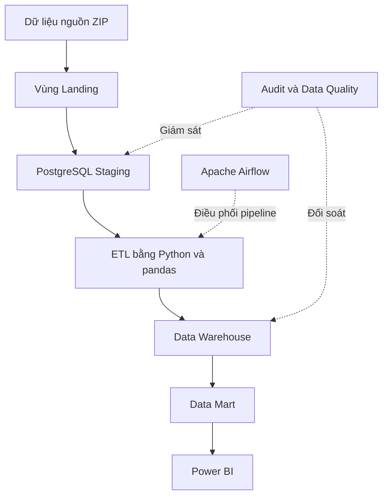

# FMCG Retail Data Warehouse

## 1. Giới thiệu

Đây là đồ án tiểu luận chuyên ngành với đề tài:

> **Xây dựng hệ thống kho dữ liệu bán lẻ FMCG phục vụ phân tích doanh số, giá bán và hiệu quả khuyến mãi**

Đề tài xây dựng một hệ thống kho dữ liệu từ bộ dữ liệu bán lẻ **dunnhumby – Breakfast at the Frat**. Hệ thống dự kiến thực hiện các công việc từ tiếp nhận dữ liệu nguồn, kiểm tra chất lượng, xử lý ETL, thiết kế mô hình dữ liệu đa chiều, xây dựng Data Mart đến trực quan hóa kết quả bằng Power BI.

## 2. Mục tiêu

Các mục tiêu chính của đề tài gồm:

* Khảo sát cấu trúc và đánh giá chất lượng dữ liệu nguồn.
* Xây dựng vùng Landing và Staging để tiếp nhận dữ liệu.
* Xây dựng quy trình ETL bằng Python và pandas.
* Thiết kế kho dữ liệu theo mô hình hình sao.
* Xây dựng các quy tắc kiểm tra chất lượng dữ liệu.
* Xây dựng Data Mart phục vụ từng nhóm yêu cầu phân tích.
* Phân tích doanh số, sản lượng, giá bán và mức giảm giá.
* So sánh kết quả bán hàng giữa các điều kiện khuyến mãi.
* Phân tích hoạt động bán hàng theo thời gian, sản phẩm, cửa hàng và khu vực.
* Xây dựng dashboard Power BI.
* Đối soát dữ liệu nguồn với dữ liệu trong kho dữ liệu.

## 3. Bộ dữ liệu

Đề tài sử dụng bộ dữ liệu **Breakfast at the Frat** do dunnhumby cung cấp.

Nguồn dữ liệu:

* [dunnhumby Source Files](https://www.dunnhumby.com/source-files/)

### 3.1. Quy mô dữ liệu

| Thuộc tính                     |    Giá trị |
| ------------------------------ | ---------: |
| Số bản ghi bán hàng            |    524.950 |
| Khoảng thời gian               |   156 tuần |
| Thời gian bắt đầu              | 14/01/2009 |
| Thời gian kết thúc             | 04/01/2012 |
| Số cửa hàng                    |         77 |
| Số sản phẩm có giao dịch       |         55 |
| Số sản phẩm trong bảng tra cứu |         58 |
| Số nhóm ngành hàng             |          4 |

Bốn nhóm ngành hàng trong dữ liệu gồm:

* Ngũ cốc đóng hộp.
* Pizza đông lạnh.
* Bánh pretzel.
* Nước súc miệng.

### 3.2. Các bảng dữ liệu nguồn

| Bảng                  | Nội dung                                         |
| --------------------- | ------------------------------------------------ |
| `dh Transaction Data` | Dữ liệu bán hàng theo tuần, cửa hàng và sản phẩm |
| `dh Store Lookup`     | Thông tin cửa hàng, vị trí và phân khúc          |
| `dh Products Lookup`  | Thông tin sản phẩm và ngành hàng                 |
| `Glossary`            | Giải thích ý nghĩa các thuộc tính                |

### 3.3. Mức độ chi tiết của dữ liệu

Mỗi bản ghi trong bảng giao dịch thể hiện kết quả bán hàng của:

> **Một sản phẩm tại một cửa hàng trong một tuần**

Đây cũng là mức độ chi tiết dự kiến của bảng sự kiện `Fact_Weekly_Sales`.

Dữ liệu không chứa mã hóa đơn hoặc mã khách hàng cá nhân. Do đó, các chỉ số `VISITS` và `HHS` không được cộng trực tiếp giữa nhiều sản phẩm để suy ra tổng số lượt mua hoặc tổng số hộ gia đình duy nhất.

## 4. Phạm vi đề tài

### 4.1. Nội dung thực hiện

Đề tài tập trung vào:

* Khảo sát và mô tả dữ liệu nguồn.
* Kiểm tra chất lượng dữ liệu.
* Xây dựng vùng Landing và Staging.
* Thiết kế và triển khai quy trình ETL.
* Thiết kế kho dữ liệu theo mô hình đa chiều.
* Xây dựng bảng sự kiện và các bảng chiều.
* Xây dựng Data Mart.
* Phân tích doanh số và sản lượng.
* Phân tích giá bán và mức giảm giá.
* Phân tích khuyến mãi theo hướng mô tả và so sánh.
* Phân tích theo thời gian, sản phẩm, cửa hàng và khu vực.
* Xây dựng dashboard Power BI.
* Đối soát và đánh giá hệ thống.

### 4.2. Nội dung ngoài phạm vi

Đề tài không thực hiện:

* Dự báo theo thời gian.
* Xây dựng mô hình Machine Learning.
* Phân tích giỏ hàng.
* Phân tích RFM.
* Phân tích khách hàng cá nhân.
* Phân tích lợi nhuận do dữ liệu không có giá vốn.
* Khẳng định quan hệ nhân quả giữa khuyến mãi và doanh số.

Kết quả phân tích khuyến mãi chỉ phản ánh sự khác biệt quan sát được giữa các nhóm dữ liệu, không chứng minh khuyến mãi là nguyên nhân trực tiếp làm thay đổi doanh số.

## 5. Kiến trúc hệ thống dự kiến



Hệ thống dự kiến sử dụng bốn schema chính trong PostgreSQL:

| Schema    | Chức năng                                             |
| --------- | ----------------------------------------------------- |
| `staging` | Lưu dữ liệu được nạp từ nguồn trước khi biến đổi      |
| `dw`      | Lưu bảng sự kiện và các bảng chiều                    |
| `mart`    | Lưu dữ liệu tổng hợp phục vụ phân tích                |
| `audit`   | Lưu nhật ký ETL, kết quả kiểm tra và đối soát dữ liệu |

## 6. Mô hình kho dữ liệu dự kiến

Kho dữ liệu được thiết kế theo mô hình hình sao.

### 6.1. Bảng sự kiện

Bảng `Fact_Weekly_Sales` lưu dữ liệu bán hàng ở mức:

> `Tuần × Cửa hàng × Sản phẩm`

Các chỉ số chính dự kiến gồm:

* Số lượng bán (`UNITS`).
* Doanh số (`SPEND`).
* Số lượt mua chứa sản phẩm (`VISITS`).
* Số hộ gia đình mua sản phẩm (`HHS`).
* Giá bán thực tế (`PRICE`).
* Giá cơ sở (`BASE_PRICE`).
* Giá trị và tỷ lệ giảm giá.

### 6.2. Các bảng chiều

| Bảng chiều      | Nội dung                                                       |
| --------------- | -------------------------------------------------------------- |
| `Dim_Date`      | Ngày kết thúc tuần, tuần, tháng, quý và năm                    |
| `Dim_Product`   | UPC, thương hiệu, mô tả sản phẩm, tiểu nhóm và nhóm ngành hàng |
| `Dim_Store`     | Cửa hàng, thành phố, bang, phân khúc và đặc điểm cửa hàng      |
| `Dim_Promotion` | Tổ hợp các hình thức quảng cáo, trưng bày và giảm giá tạm thời |

### 6.3. Các Data Mart dự kiến

| Data Mart                 | Mục đích                                     |
| ------------------------- | -------------------------------------------- |
| `mart_sales_overview`     | Phân tích tổng quan doanh số và sản lượng    |
| `mart_price_analysis`     | Phân tích giá bán, giá cơ sở và mức giảm giá |
| `mart_promotion_analysis` | So sánh các hình thức khuyến mãi             |
| `mart_product_store`      | Phân tích sản phẩm và cửa hàng               |

## 7. Các chỉ số phân tích dự kiến

Các chỉ số chính gồm:

* Tổng doanh số.
* Tổng số lượng bán.
* Giá bán bình quân gia quyền.
* Giá cơ sở bình quân gia quyền.
* Giá trị giảm giá.
* Tỷ lệ giảm giá.
* Số lượng sản phẩm trên mỗi lượt mua.
* Doanh số trên mỗi lượt mua.
* Tỷ lệ bản ghi có khuyến mãi.
* Mức chênh lệch doanh số giữa nhóm có và không có khuyến mãi.
* Mức chênh lệch sản lượng giữa các hình thức khuyến mãi.

## 8. Công nghệ sử dụng

| Công nghệ      | Mục đích                                     |
| -------------- | -------------------------------------------- |
| Python         | Xây dựng chương trình xử lý dữ liệu          |
| pandas         | Làm sạch, chuẩn hóa và biến đổi dữ liệu      |
| PostgreSQL     | Lưu trữ Staging, Data Warehouse và Data Mart |
| Apache Airflow | Điều phối và giám sát pipeline ETL           |
| Docker Compose | Quản lý môi trường triển khai                |
| Power BI       | Xây dựng dashboard và trực quan hóa dữ liệu  |
| Git            | Quản lý phiên bản mã nguồn                   |

## 9. Cấu trúc thư mục

```text
fmcg-data-warehouse/
├── airflow/                       # DAG và cấu hình Airflow
├── dashboard/                     # Tệp Power BI và tài liệu dashboard
├── data/
│   ├── raw/                       # Tệp ZIP nguồn nguyên bản
│   └── landing/                   # Dữ liệu được giải nén từ nguồn
├── docs/
│   ├── architecture/              # Tài liệu kiến trúc hệ thống
│   ├── dataset/                   # Hồ sơ và từ điển dữ liệu nguồn
│   ├── project/                   # Phạm vi, kế hoạch và tiến độ
│   └── requirements/              # Câu hỏi nghiệp vụ và định nghĩa KPI
├── sql/                           # DDL, truy vấn ETL và Data Mart
├── src/                           # Mã nguồn Python
├── .gitignore
└── README.md
```

Dữ liệu nguồn có kích thước lớn và có thể chịu điều kiện sử dụng của đơn vị cung cấp. Vì vậy, không nên đưa trực tiếp các tệp dữ liệu trong `data/raw` và `data/landing` lên repository công khai.

## 10. Các vấn đề chất lượng dữ liệu đã xác định

Kết quả khảo sát ban đầu ghi nhận:

| Vấn đề                                     | Số lượng |
| ------------------------------------------ | -------: |
| Bản ghi thiếu `PRICE`                      |       23 |
| Bản ghi thiếu `BASE_PRICE`                 |      185 |
| Bản ghi có `PRICE > BASE_PRICE`            |    6.047 |
| Bản ghi có `UNITS < VISITS`                |    2.309 |
| Cửa hàng bị trùng và mâu thuẫn phân khúc   |        2 |
| Giao dịch bị ảnh hưởng bởi lỗi cửa hàng    |   13.693 |
| Bản ghi cửa hàng thiếu `PARKING_SPACE_QTY` |       52 |
| Sản phẩm trong lookup không có giao dịch   |        3 |

Hai mã cửa hàng cần xử lý trước khi nối dữ liệu:

* `4503`
* `17627`

Hai cửa hàng này xuất hiện với hai giá trị phân khúc khác nhau là `MAINSTREAM` và `UPSCALE`. Nếu nối bảng trực tiếp mà không xử lý, các dòng giao dịch liên quan có thể bị nhân đôi.

Ngoài các vấn đề trên, kết quả khảo sát ban đầu cho thấy:

* Không trùng khóa tự nhiên `WEEK_END_DATE + STORE_NUM + UPC`.
* Không có khóa sản phẩm hoặc cửa hàng không tồn tại.
* Không có giá trị âm trong các chỉ số chính.
* Các biến khuyến mãi chỉ chứa giá trị `0` và `1`.
* Dữ liệu có đủ 156 tuần liên tục.

## 11. Trạng thái hiện tại

Dự án hiện đang ở **Giai đoạn 1 – Chuẩn bị đề tài và dữ liệu**.

Các nội dung đã thực hiện:

* Xác định tên đề tài.
* Xác định mục tiêu và phạm vi nghiên cứu.
* Thu thập và lưu trữ dữ liệu nguồn.
* Kiểm tra tính toàn vẹn của tệp dữ liệu.
* Khảo sát cấu trúc các bảng.
* Xây dựng từ điển dữ liệu nguồn.
* Xác định mức độ chi tiết của dữ liệu.
* Đánh giá sơ bộ chất lượng dữ liệu.
* Xác định câu hỏi nghiệp vụ và KPI.
* Đề xuất kiến trúc tổng thể.
* Xây dựng kế hoạch thực hiện đề tài

Các thành phần ETL, cơ sở dữ liệu, Airflow và Power BI chưa được triển khai tại giai đoạn này.

## 12. Kế hoạch thực hiện tiếp theo

### Giai đoạn 2: Phân tích yêu cầu và thiết kế hệ thống

* Hoàn thiện yêu cầu nghiệp vụ.
* Thiết kế vùng Staging.
* Xây dựng Source-to-Target Mapping.
* Thiết kế mô hình hình sao.
* Thiết kế bảng audit và Data Quality.
* Viết các câu lệnh DDL.

### Giai đoạn 3: Xây dựng cơ sở dữ liệu

* Khởi tạo PostgreSQL bằng Docker Compose.
* Tạo các schema.
* Tạo bảng Staging.
* Tạo các bảng chiều và bảng sự kiện.
* Tạo bảng nhật ký và kiểm soát chất lượng.

### Giai đoạn 4: Xây dựng ETL

* Trích xuất dữ liệu từ Excel.
* Kiểm tra và làm sạch dữ liệu.
* Chuẩn hóa kiểu dữ liệu.
* Xử lý dữ liệu lỗi.
* Nạp bảng chiều.
* Nạp bảng sự kiện.
* Đối soát dữ liệu sau khi nạp.

### Giai đoạn 5: Điều phối bằng Airflow

* Xây dựng DAG ETL.
* Cấu hình thứ tự các tác vụ.
* Thiết lập logging và xử lý lỗi.
* Kiểm tra khả năng chạy lại pipeline.

### Giai đoạn 6: Xây dựng Data Mart và dashboard

* Xây dựng các bảng tổng hợp.
* Kết nối Power BI với PostgreSQL.
* Xây dựng các chỉ số DAX.
* Thiết kế dashboard.
* Kiểm tra tính chính xác của số liệu.

### Giai đoạn 7: Đánh giá và hoàn thiện

* Đánh giá chất lượng dữ liệu.
* Đối soát dữ liệu nguồn và kho dữ liệu.
* Đánh giá hiệu năng truy vấn.
* Đánh giá pipeline ETL.
* Hoàn thiện báo cáo và nội dung trình bày.

## 13. Hướng dẫn chạy dự án

Dự án hiện chưa bước vào giai đoạn triển khai nên chưa có phiên bản chạy hoàn chỉnh.

Hướng dẫn cài đặt và vận hành sẽ được bổ sung sau khi hoàn thành:

* Tệp `docker-compose.yml`.
* Cấu hình kết nối PostgreSQL.
* Các câu lệnh tạo cơ sở dữ liệu.
* Chương trình ETL.
* DAG Airflow.
* Data Mart.
* Dashboard Power BI.

## 14. Sinh viên thực hiện

| MSSV | Họ và tên |
|---|---|
| 23133006 | Phạm Trần Quốc Bảo |

Đề tài được thực hiện theo hình thức tiểu luận cá nhân.

## 15. Lưu ý sử dụng dữ liệu

Bộ dữ liệu được sử dụng cho mục đích học tập và nghiên cứu. Quyền sở hữu và các điều kiện sử dụng dữ liệu thuộc về dunnhumby.

Kết quả phân tích chỉ phản ánh các sản phẩm, cửa hàng, khu vực và khoảng thời gian có trong bộ dữ liệu. Kết quả không đại diện cho toàn bộ thị trường FMCG và không được sử dụng để khái quát trực tiếp cho thị trường bán lẻ FMCG tại Việt Nam.
