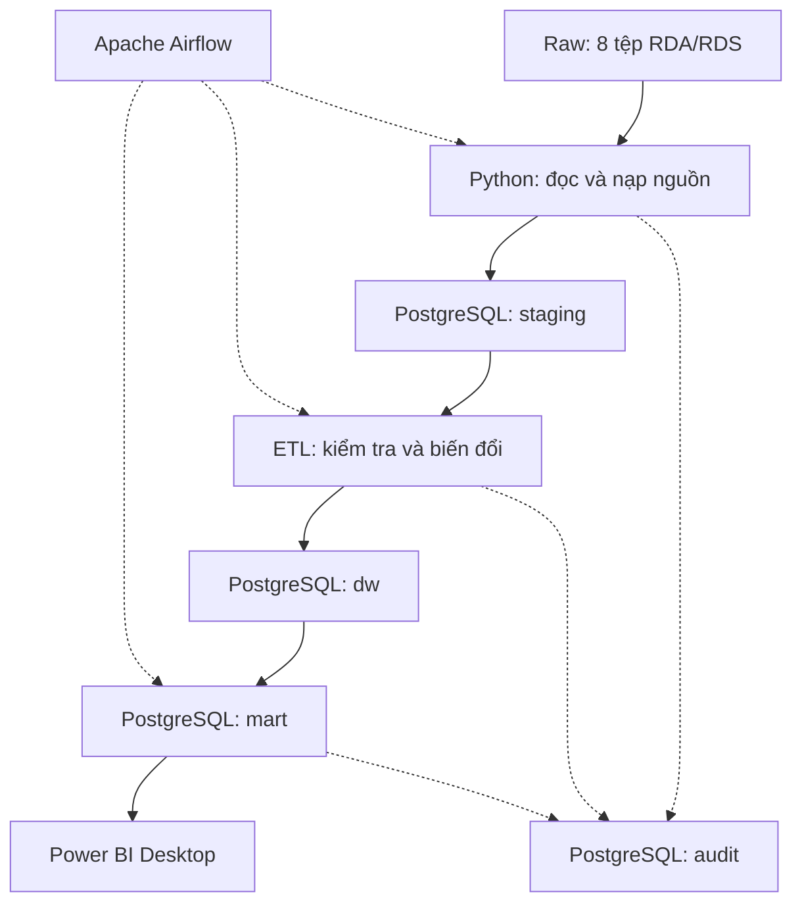

# Kiến trúc tổng thể đề xuất

## 1. Mục tiêu kiến trúc

Hệ thống tích hợp tám bảng Complete Journey vào kho dữ liệu PostgreSQL, phục vụ phân tích doanh số, giá bán và khuyến mãi.

Hệ thống triển khai cục bộ, có khả năng chạy lại pipeline, kiểm tra chất lượng và truy vết nguồn dữ liệu.

## 2. Luồng xử lý

Vùng Landing được sử dụng nếu cần lưu bản chuyển đổi trung gian để tối ưu việc đọc và nạp. Không bắt buộc chuyển dữ liệu sang Excel hoặc CSV.

## 3. Thành phần

| Thành phần       | Công nghệ            | Trách nhiệm                                        |
| ---------------- | -------------------- | -------------------------------------------------- |
| Raw              | File system          | Giữ nguyên tám tệp nguồn                           |
| Đọc nguồn        | Python, pyreadr      | Đọc RDA/RDS và kiểm tra cấu trúc                   |
| Landing, nếu cần | File system          | Lưu bản chuyển đổi có thể tái tạo                  |
| Staging          | PostgreSQL `staging` | Giữ dữ liệu gần nguồn và metadata                  |
| Biến đổi         | Python, pandas, SQL  | Chuẩn hóa, kiểm tra, phân loại FMCG và ánh xạ khóa |
| Kho dữ liệu      | PostgreSQL `dw`      | Lưu các nghiệp vụ ở grain đã xác định              |
| Data Mart        | PostgreSQL `mart`    | Cung cấp dữ liệu và công thức dùng chung cho BI    |
| Audit            | PostgreSQL `audit`   | Ghi lần chạy, lỗi, số dòng và đối soát             |
| Điều phối        | Apache Airflow       | Quản lý phụ thuộc, trạng thái và retry             |
| Trực quan hóa    | Power BI Desktop     | Dashboard và bộ lọc                                |
| Môi trường       | Docker Compose       | Quản lý các dịch vụ cục bộ                         |

Airflow điều phối việc xử lý bộ nguồn hiện có; lịch chạy không đồng nghĩa nguồn có dữ liệu mới liên tục.

## 4. Nguyên tắc Staging và ETL

* Tách bảng Staging theo tám bảng nguồn.
* Giữ mã định danh dạng chuỗi.
* Bảo toàn giá trị nguồn để truy vết.
* Gắn thông tin lần nạp và tệp nguồn.
* Kiểm tra cấu trúc trước khi nạp.
* Chuẩn hóa kiểu dữ liệu mà không tự suy diễn giá trị thiếu.
* Áp dụng quy tắc phạm vi FMCG có phiên bản.
* Ghi riêng các trường hợp ngoài phạm vi và cần xem xét.
* Nạp Dimension trước các Fact phụ thuộc.
* Chỉ công bố dữ liệu cho Data Mart sau khi qua các kiểm tra bắt buộc.

Bảng khuyến mãi có hơn 20 triệu dòng. Thiết kế phải kiểm soát bộ nhớ khi đọc, tránh giữ nhiều bản sao DataFrame và sử dụng cơ chế nạp hàng loạt phù hợp.

## 5. Mô hình đa chiều sơ bộ

Hệ thống sử dụng nhiều Fact dùng chung Dimension. Mỗi Fact biểu diễn một nghiệp vụ riêng.

### 5.1. Các Fact

| Fact                      | Grain                     | Nội dung                                              |
| ------------------------- | ------------------------- | ----------------------------------------------------- |
| `Fact_Sales`              | Sản phẩm–giỏ hàng         | Số lượng, giá trị bán và ba khoản giảm giá            |
| `Fact_Promotion_Weekly`   | Sản phẩm–cửa hàng–tuần    | Cờ trưng bày và quảng cáo sau tổng hợp                |
| `Fact_Coupon_Redemption`  | Hộ–coupon–chiến dịch–ngày | Ghi nhận sử dụng coupon                               |
| `Fact_Campaign_Household` | Hộ–chiến dịch             | Fact không có số đo tiền, ghi nhận hộ nhận chiến dịch |

`Fact_Promotion_Weekly` thể hiện thông tin hỗ trợ tại cửa hàng, không chứng minh hộ đã nhìn thấy quảng cáo hoặc trưng bày.

### 5.2. Các Dimension

| Dimension       | Nội dung                                                  |
| --------------- | --------------------------------------------------------- |
| `Dim_Date`      | Ngày, tháng, quý và năm                                   |
| `Dim_Week`      | Mã tuần nguồn và khoảng ngày đã xác minh                  |
| `Dim_Product`   | Sản phẩm, ngành hàng, quy cách và trạng thái phạm vi FMCG |
| `Dim_Store`     | Mã cửa hàng; chưa có địa lý hoặc phân khúc                |
| `Dim_Household` | Mã hộ và nhân khẩu học nếu có                             |
| `Dim_Campaign`  | Loại và thời gian chiến dịch                              |
| `Dim_Coupon`    | Mã coupon và thông tin nhận diện phù hợp nguồn            |

Ngày bắt đầu và kết thúc chiến dịch có thể tham chiếu `Dim_Date` theo các vai trò khác nhau.

### 5.3. Quan hệ dự kiến

| Fact                      | Dimension liên quan                   |
| ------------------------- | ------------------------------------- |
| `Fact_Sales`              | Date, Week, Product, Store, Household |
| `Fact_Promotion_Weekly`   | Week, Product, Store                  |
| `Fact_Coupon_Redemption`  | Date, Household, Campaign, Coupon     |
| `Fact_Campaign_Household` | Household, Campaign                   |

`basket_id` được giữ trong Fact bán hàng để truy vết và đếm giỏ hàng phân biệt.

Bảng `Bridge_Coupon_Campaign_Product` lưu các liên kết coupon–chiến dịch–sản phẩm sau xử lý trùng.

## 6. Quy tắc tích hợp quan trọng

### Giao dịch và khuyến mãi

* Tổng hợp `promotions` về một dòng trên sản phẩm–cửa hàng–tuần trước khi bổ sung trạng thái cho dữ liệu bán hàng.
* Không nối trực tiếp bảng khuyến mãi thô vào giao dịch rồi cộng tiền.
* Giữ trạng thái chưa biết cho các giao dịch không khớp.
* Có thể tạo trạng thái hỗ trợ phục vụ Data Mart mà không thêm một Dimension chỉ để tăng số bảng.

### Coupon và giao dịch

* Không gắn trực tiếp coupon hoặc chiến dịch vào Fact bán hàng khi nguồn không xác định liên kết đó.
* Không cộng bản ghi sử dụng coupon sau phép nối với nhiều sản phẩm áp dụng.
* Các Fact được tổng hợp riêng ở grain phù hợp trước khi kết hợp kết quả phân tích.

### Hộ gia đình và sản phẩm

* Xây danh sách hộ từ các nguồn nghiệp vụ liên quan, sau đó bổ sung nhân khẩu học.
* Không loại giao dịch vì hộ thiếu nhân khẩu học.
* Giữ mã sản phẩm chưa có danh mục bằng cơ chế bản ghi chưa đầy đủ hoặc Unknown có truy vết.
* Không tự coi sản phẩm chưa xác định là FMCG.

## 7. Data Mart

| Data Mart                 | Nguồn kho dữ liệu chính                   | Mục đích                                    |
| ------------------------- | ----------------------------------------- | ------------------------------------------- |
| `mart_sales_overview`     | Fact bán hàng và Dimension                | Tổng quan bán hàng                          |
| `mart_price_analysis`     | Fact bán hàng và sản phẩm                 | Giá trị bán trên đơn vị, các khoản giảm giá |
| `mart_promotion_analysis` | Bán hàng tổng hợp tuần và khuyến mãi tuần | Bao phủ, so sánh trưng bày/quảng cáo        |
| `mart_campaign_coupon`    | Fact hộ nhận chiến dịch và sử dụng coupon | Kết quả chiến dịch–coupon                   |

Mart chiến dịch–coupon phải phân biệt phạm vi toàn nguồn với phạm vi FMCG của các mart bán hàng.

## 8. Audit và khả năng chạy lại

Mỗi lần chạy cần ghi:

* `run_id`.
* Thời điểm bắt đầu và kết thúc.
* Trạng thái thực hiện.
* Tệp và bảng được xử lý.
* Số dòng đầu vào, đầu ra.
* Kết quả kiểm tra khóa và chất lượng.
* Tổng các số đo cần đối soát.
* Lý do loại, tổng hợp hoặc cách ly bản ghi.

Chạy lại cùng dữ liệu không được tạo bản ghi trùng. Cơ chế thay thế dữ liệu, upsert hoặc nạp theo batch sẽ được lựa chọn ở Giai đoạn 2.

## 9. Các quyết định còn mở

* Phạm vi ngành hàng FMCG.
* Ánh xạ tuần và xử lý múi giờ.
* Đơn vị số lượng theo sản phẩm.
* Công thức giá trước giảm và tiền khách trả.
* Precision, scale của số tiền và số lượng.
* Cách lưu lịch sử Dimension.
* Cơ chế nạp và công bố dữ liệu sau kiểm tra.

Các nội dung trên phải được chốt trước khi triển khai phần ETL liên quan.
