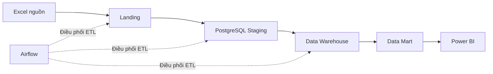
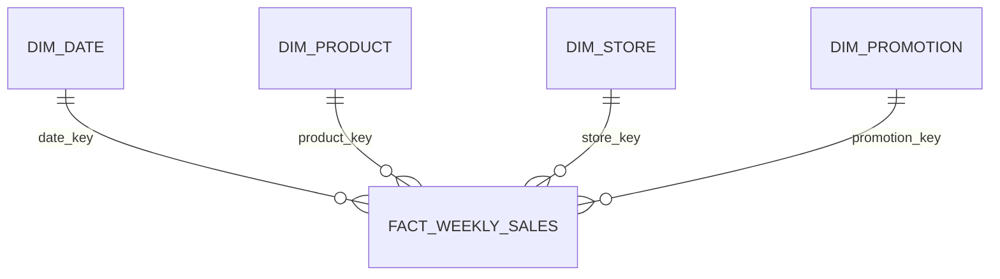

# Kiến trúc tổng thể đề xuất

## 1. Luồng dữ liệu

## 2. Thành phần

| Thành phần | Công nghệ | Vai trò |
|---|---|---|
| Nguồn | XLSX và PDF | Dữ liệu bán hàng và tài liệu giải thích |
| Landing | File system cục bộ | Lưu bản được giải nén để pipeline đọc |
| Staging | PostgreSQL schema `staging` | Giữ cấu trúc gần nguồn và metadata lần nạp |
| Xử lý | Python, pandas | Làm sạch, chuẩn hóa, kiểm tra và ánh xạ khóa |
| Data Warehouse | PostgreSQL schema `dw` | Lưu Fact và Dimension theo mô hình sao |
| Data Mart | PostgreSQL schema `mart` | Cung cấp bảng/view phục vụ từng nhóm phân tích |
| Điều phối | Apache Airflow | Quản lý thứ tự task, lịch chạy, retry và trạng thái |
| Audit | PostgreSQL schema `audit` | Lưu thông tin lần chạy và lỗi chất lượng dữ liệu |
| BI | Power BI | Trực quan hóa và khai thác dữ liệu |
| Môi trường | Docker Compose | Khởi tạo PostgreSQL, Airflow và các dịch vụ liên quan |

## 3. Mô hình đa chiều sơ bộ

Grain của Fact_Weekly_Sales là kết quả bán hàng của một sản phẩm tại một cửa hàng trong một tuần. Trạng thái khuyến mãi là thuộc tính mô tả của quan sát, được liên kết thông qua promotion_key.

Các bảng dự kiến:

- `Dim_Date`: ngày, tuần, tháng, quý và năm.
- `Dim_Product`: UPC, mô tả, nhà sản xuất, ngành hàng, tiểu ngành hàng và kích thước.
- `Dim_Store`: mã, tên, thành phố, bang, MSA, phân khúc, diện tích và thuộc tính cửa hàng.
- `Dim_Promotion`: năm trạng thái hỗ trợ khuyến mãi quan sát được.
- `Fact_Weekly_Sales`: `units`, `visits`, `hhs`, `spend`, `price`, `base_price` và các cờ chất lượng cần thiết.

Một Fact và bốn Dimension là phù hợp với số thực thể và grain của nguồn. Không tạo `Dim_Customer`, `Dim_Basket` hoặc Fact lợi nhuận vì dữ liệu không chứa các đối tượng này.

## 4. Data Mart dự kiến

| Data Mart | Mục đích |
|---|---|
| `mart_sales_overview` | Doanh số và sản lượng theo thời gian, sản phẩm và cửa hàng |
| `mart_price_analysis` | Giá bán, giá cơ sở và mức giảm giá |
| `mart_promotion_analysis` | So sánh kết quả bán hàng giữa các trạng thái khuyến mãi |
| `mart_product_store` | Hiệu quả sản phẩm theo cửa hàng và khu vực |

## 5. Nguyên tắc thiết kế

- Dữ liệu nguồn bất biến.
- ETL có thể chạy lại mà không làm nhân đôi dữ liệu.
- Mỗi lần chạy có `run_id`, thời gian bắt đầu, kết thúc và trạng thái.
- Fact dùng surrogate key của các Dimension; business key vẫn được giữ để truy vết.
- Bản ghi không ánh xạ được sử dụng dòng Unknown thay vì bị loại âm thầm.
- Data Mart lấy dữ liệu từ Data Warehouse, không đọc trực tiếp file Excel.
- Power BI đọc Data Mart để tránh lặp logic KPI ở nhiều dashboard.

