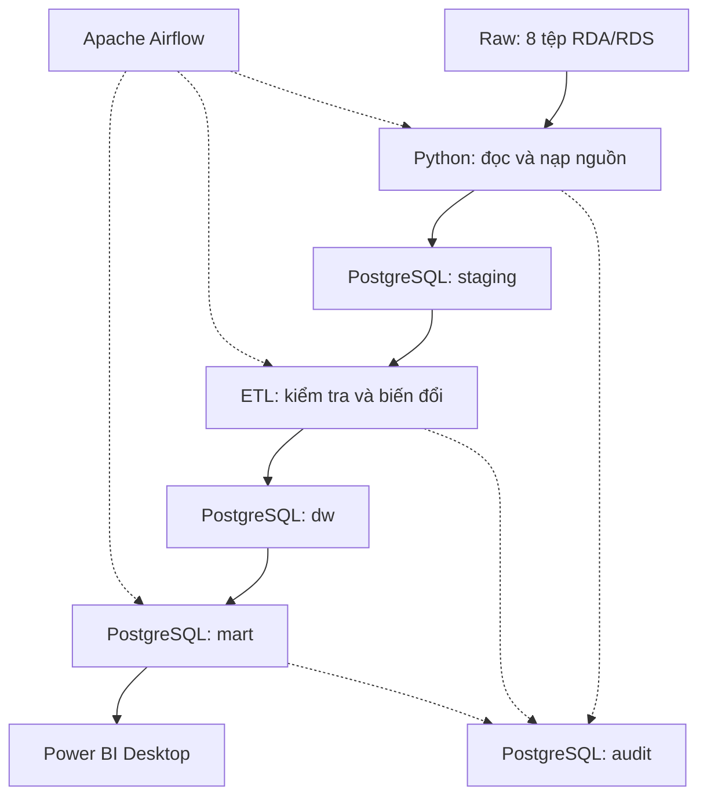

# Kiến trúc tổng thể đề xuất

## 1. Mục tiêu kiến trúc

Hệ thống tích hợp tám bảng Complete Journey vào kho dữ liệu PostgreSQL, phục vụ phân tích doanh số, giá bán và khuyến mãi.

Hệ thống triển khai cục bộ, có khả năng chạy lại pipeline, kiểm tra chất lượng và truy vết nguồn dữ liệu.

## 2. Luồng xử lý

```mermaid
flowchart TB
    R["Raw: 8 tệp RDA/RDS"] --> E["Python: đọc và nạp nguồn"]
    E --> S["PostgreSQL: staging"]
    S --> T["ETL: kiểm tra và biến đổi"]
    T --> W["PostgreSQL: dw"]
    W --> M["PostgreSQL: mart"]
    M --> B["Power BI Desktop"]

    A["Apache Airflow"] -.-> E
    A -.-> T
    A -.-> M

    E -.-> Q["PostgreSQL: audit"]
    T -.-> Q
    M -.-> Q
```

Vùng Landing được sử dụng nếu cần lưu bản chuyển đổi trung gian để tối ưu việc đọc và nạp. Không bắt buộc chuyển dữ liệu sang Excel hoặc CSV.

## 3. Thành phần

| Thành phần       | Công nghệ            | Trách nhiệm                                        |
| ---------------- | -------------------- | -------------------------------------------------- |
| Raw              | File system          | Giữ nguyên tám tệp nguồn                           |
| Đọc nguồn        | Python, pyreadr      | Đọc RDA/RDS và kiểm tra cấu trúc                   |
| Landing, nếu cần | File system          | Lưu bản chuyển đổi có thể tái tạo                  |
| Staging          | PostgreSQL `staging` | Giữ dữ liệu gần nguồn và metadata                  |
| Biến đổi         | Python, pandas, SQL  | Chuẩn hóa, kiểm tra, phân loại FMCG và ánh xạ khóa |
| Kho dữ liệu      | PostgreSQL `dw`      | Lưu các nghiệp vụ ở grain đã xác định              |
| Data Mart        | PostgreSQL `mart`    | Cung cấp dữ liệu và công thức dùng chung cho BI    |
| Audit            | PostgreSQL `audit`   | Ghi lần chạy, lỗi, số dòng và đối soát             |
| Điều phối        | Apache Airflow       | Quản lý phụ thuộc, trạng thái và retry             |
| Trực quan hóa    | Power BI Desktop     | Dashboard và bộ lọc                                |
| Môi trường       | Docker Compose       | Quản lý các dịch vụ cục bộ                         |

Airflow điều phối việc xử lý bộ nguồn hiện có; lịch chạy không đồng nghĩa nguồn có dữ liệu mới liên tục.

## 4. Nguyên tắc Staging và ETL

* Tách bảng Staging theo tám bảng nguồn.
* Giữ mã định danh dạng chuỗi.
* Bảo toàn giá trị nguồn để truy vết.
* Gắn thông tin lần nạp và tệp nguồn.
* Kiểm tra cấu trúc trước khi nạp.
* Chuẩn hóa kiểu dữ liệu mà không tự suy diễn giá trị thiếu.
* Áp dụng quy tắc phạm vi FMCG có phiên bản.
* Ghi riêng các trường hợp ngoài phạm vi và cần xem xét.
* Nạp Dimension trước các Fact phụ thuộc.
* Chỉ công bố dữ liệu cho Data Mart sau khi qua các kiểm tra bắt buộc.

Bảng khuyến mãi có hơn 20 triệu dòng. Thiết kế phải kiểm soát bộ nhớ khi đọc, tránh giữ nhiều bản sao DataFrame và sử dụng cơ chế nạp hàng loạt phù hợp.

## 5. Mô hình đa chiều

Hệ thống gồm **3 Fact, 7 Dimension và 2 Bridge**.
Các bảng dùng tên thống nhất với SQL DDL trong schema `dw`.

### 5.1. Các Fact

| Fact | Grain | Nội dung |
|---|---|---|
| `fact_sales` | Giỏ hàng–sản phẩm | Số lượng, giá trị bán và ba khoản giảm giá nguồn |
| `fact_promotion_weekly` | Sản phẩm–cửa hàng–tuần | Trạng thái trưng bày, quảng cáo và tập mã nguồn sau tổng hợp |
| `fact_coupon_redemption` | Hộ–coupon–chiến dịch–ngày | Bản ghi sử dụng coupon; mỗi dòng có redemption_record_count = 1 |

`fact_sales` và `fact_promotion_weekly` chỉ nạp sản phẩm IN_SCOPE
theo phiên bản phân loại FMCG đã chọn.

`fact_coupon_redemption` giữ toàn bộ bản ghi nguồn, không tự xác định
sản phẩm thực tế được mua hoặc gắn nhãn chỉ FMCG.

Thông tin khuyến mãi tại cửa hàng không chứng minh hộ gia đình
đã nhìn thấy quảng cáo hoặc trưng bày.

### 5.2. Các Dimension

| Dimension | Nội dung |
|---|---|
| `dim_date` | Ngày, tháng, quý, năm và thứ trong tuần |
| `dim_week` | Tuần nguồn, khoảng ngày lịch và khoảng ngày thuộc phạm vi dữ liệu |
| `dim_product` | Sản phẩm, ngành hàng, quy cách và trạng thái phạm vi FMCG |
| `dim_store` | Mã cửa hàng; không có thông tin địa lý hoặc phân khúc |
| `dim_household` | Mã hộ và nhân khẩu học nếu có |
| `dim_campaign` | Mã, loại và thời gian chiến dịch |
| `dim_coupon` | Coupon được định danh bằng campaign_id + coupon_upc |

`dim_coupon.campaign_key` liên kết với `dim_campaign`.

Ngày bắt đầu và kết thúc chiến dịch được lưu bằng kiểu DATE
trong `dim_campaign`; DDL hiện tại không tạo khóa ngoại
từ hai cột này đến `dim_date`.

### 5.3. Quan hệ Fact–Dimension

| Fact | Dimension liên kết trực tiếp |
|---|---|
| `fact_sales` | Date, Week, Product, Store, Household |
| `fact_promotion_weekly` | Week, Product, Store |
| `fact_coupon_redemption` | Date, Household, Campaign, Coupon |

`basket_id` được giữ trong `fact_sales` để truy vết và đếm
giỏ hàng phân biệt.

Cặp coupon–chiến dịch trong `fact_coupon_redemption`
phải nhất quán với chiến dịch của coupon trong `dim_coupon`.

### 5.4. Các Bridge

| Bridge | Khóa chính ghép | Ý nghĩa |
|---|---|---|
| `bridge_campaign_household` | campaign_key + household_key | Hộ gia đình nhận chiến dịch |
| `bridge_coupon_product` | coupon_key + product_key | Sản phẩm đủ điều kiện áp dụng coupon |

Quan hệ hộ–chiến dịch được triển khai bằng
`bridge_campaign_household`, không tạo thêm một Fact riêng.

Chiến dịch của coupon được xác định qua `dim_coupon`.
Danh sách sản phẩm áp dụng coupon không cho biết sản phẩm
thực tế trong từng lần sử dụng coupon.
## 6. Quy tắc tích hợp quan trọng

### Giao dịch và khuyến mãi

* Tổng hợp `promotions` về một dòng trên sản phẩm–cửa hàng–tuần trước khi bổ sung trạng thái cho dữ liệu bán hàng.
* Không nối trực tiếp bảng khuyến mãi thô vào giao dịch rồi cộng tiền.
* Giữ trạng thái chưa biết cho các giao dịch không khớp.
* Có thể tạo trạng thái hỗ trợ phục vụ Data Mart mà không thêm một Dimension chỉ để tăng số bảng.

### Coupon và giao dịch

* Không gắn trực tiếp coupon hoặc chiến dịch vào Fact bán hàng khi nguồn không xác định liên kết đó.
* Không cộng bản ghi sử dụng coupon sau phép nối với nhiều sản phẩm áp dụng.
* Các Fact được tổng hợp riêng ở grain phù hợp trước khi kết hợp kết quả phân tích.

### Hộ gia đình và sản phẩm

* Xây danh sách hộ từ các nguồn nghiệp vụ liên quan, sau đó bổ sung nhân khẩu học.
* Không loại giao dịch vì hộ thiếu nhân khẩu học.
* Giữ mã sản phẩm chưa có danh mục bằng cơ chế bản ghi chưa đầy đủ hoặc Unknown có truy vết.
* Không tự coi sản phẩm chưa xác định là FMCG.

## 7. Data Mart

| Data Mart                 | Nguồn kho dữ liệu chính                   | Mục đích                                    |
| ------------------------- | ----------------------------------------- | ------------------------------------------- |
| `mart_sales_overview`     | Fact bán hàng và Dimension                | Tổng quan bán hàng                          |
| `mart_price_analysis`     | Fact bán hàng và sản phẩm                 | Giá trị bán trên đơn vị, các khoản giảm giá |
| `mart_promotion_analysis` | Bán hàng tổng hợp tuần và khuyến mãi tuần | Bao phủ, so sánh trưng bày/quảng cáo        |
| `mart_campaign_coupon` | `bridge_campaign_household`, `fact_coupon_redemption` và các Dimension liên quan | Phân tích hộ nhận chiến dịch và bản ghi sử dụng coupon |

Mart chiến dịch–coupon phải phân biệt phạm vi toàn nguồn với phạm vi FMCG của các mart bán hàng.

## 8. Audit và khả năng chạy lại

Schema `audit` lưu thông tin lần nạp nguồn, lần nạp kho dữ liệu,
kết quả kiểm tra chất lượng và đối soát.

Các thông tin cần ghi gồm:

- Mã lần nạp nguồn `etl_batch_id`.
- Thông tin lần nạp kho dữ liệu.
- Thời điểm bắt đầu, kết thúc và trạng thái.
- Tệp nguồn, mã kiểm tra nội dung tệp và phiên bản quy tắc FMCG.
- Số dòng đầu vào, đầu ra.
- Kết quả kiểm tra khóa và chất lượng.
- Tổng số đo cần đối soát.
- Lý do loại, tổng hợp hoặc chặn nạp bản ghi.

Chạy lại cùng dữ liệu không được tạo bản ghi trùng.
Chỉ công bố dữ liệu sau khi vượt qua kiểm tra bắt buộc và đối soát.

Thiết kế chi tiết được mô tả trong `staging_design.md`,
`source_to_target_mapping.md` và SQL DDL.
Khả năng chạy lại sẽ được kiểm thử khi triển khai ETL.
## 9. Các quyết định thiết kế và nội dung còn mở

### Đã xác định

- Phạm vi FMCG dùng quy tắc v1.3; nhóm REVIEW chưa đưa vào KPI FMCG.
- Ngày giao dịch được xác định theo múi giờ America/New_York.
- Tuần nguồn được đối chiếu bằng quy tắc %W + 1.
- Các Dimension nghiệp vụ áp dụng cập nhật Type 1,
  không tự tạo lịch sử khi nguồn không cung cấp.
- Kiểu dữ liệu và ràng buộc đã được mô tả trong SQL DDL.
- Ba trường giảm giá được lưu và tổng hợp riêng.

### Còn cần xác minh hoặc kiểm thử

- Đơn vị vật lý của quantity khi cần so sánh giữa các sản phẩm.
- Công thức giá trước giảm, tiền khách thực trả
  và tỷ lệ giảm giá kết hợp.
- Khả năng thực thi DDL trên PostgreSQL.
- Khả năng chạy lại, phục hồi lỗi và công bố dữ liệu của ETL.

Các công thức chưa xác minh không được đưa vào KPI chính thức.